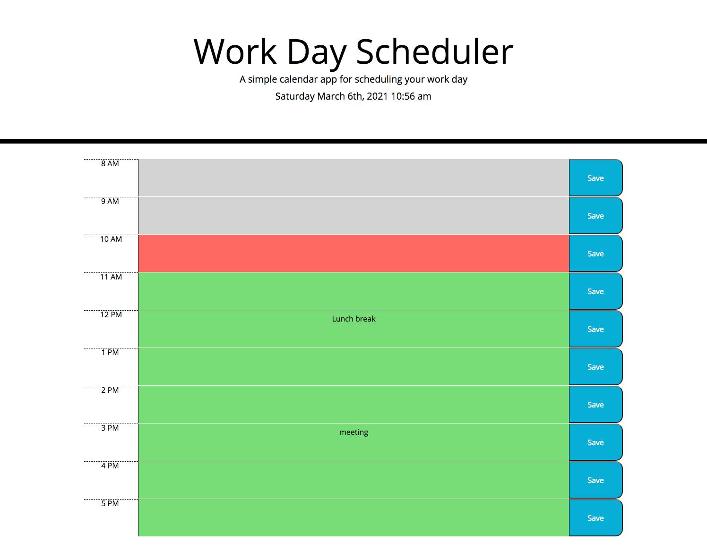

# Work Day Scheduler Assignment

## Description
The goal of this project was to create a work day scheduler tool. It uses moment to show the date and time. Based on the current time, the hour blocks are color coded. Plans can be listed in each block and saved to local storage. 

## Installation

Visit this link to view the scheduler tool: https://abbeyschu.github.io/homework5_AS/

## Screenshots

## License 

[MIT](https://github.com/abbeyschu/homework5_AS/raw/main/Assets/license.txt)